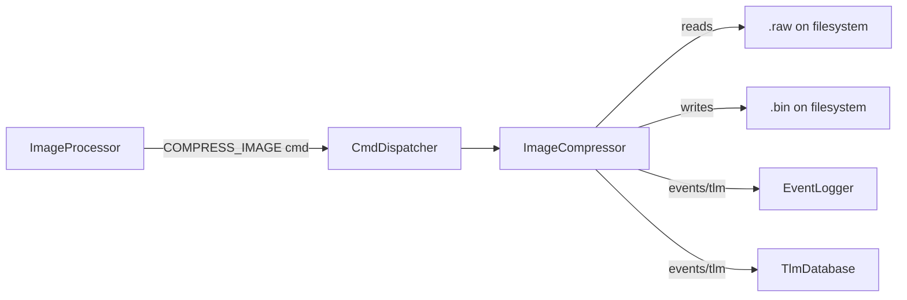
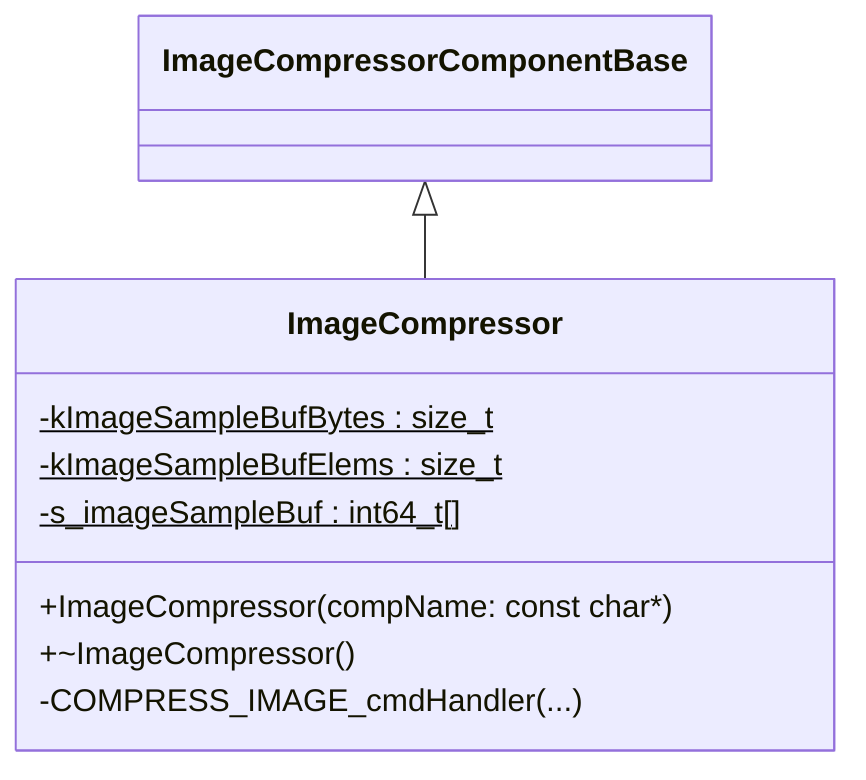
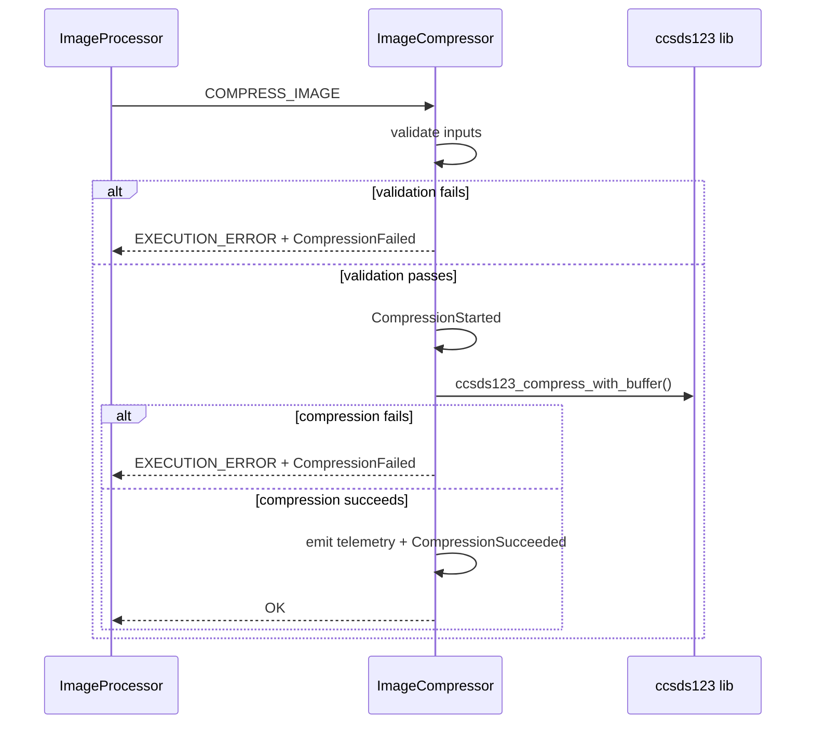

# ImageProcessor::ImageCompressor

Compresses image (.raw) into .bin using CCSDS123 algo

## Usage Examples
Example command usage:

- Compress a raw image (row-major, 8-bit values stored contigously, no header/padding) with explicit dimensions and data type.
- Provide an output directory (the output file is created under that directory).

Command:

`COMPRESS_IMAGE /data/cam/hi_im_an_image.raw /data/cam/compressed 1 1024 1024 1 u8be 1048576`

### Diagrams



* Note: unsure if you would say ground (GDS) can execute command since we do have ```fprime-gds```
### Typical Usage
The component receives `COMPRESS_IMAGE`, validates inputs, compresses the image using CCSDS123, emits events, and publishes telemetry for runtime and sizes.

## Class Diagram


* ImageCompressorComponentBase is the generated base

## Port Descriptions
| Name | Description |
|---|---|
| timeCaller | Time get port used for compression timing telemetry. |
| prmGetOut | Parameter get port. |
| prmSetOut | Parameter set port. |
| cmdIn/cmdOut | Standard command receive/response ports from `Fw.Command`. |
| eventOut | Standard event output port from `Fw.Event`. |
| tlmOut | Standard telemetry output port from `Fw.Channel`. |

## Component States
Add component states in the chart below
| Name | Description |
|---|---|
| Idle | No compression in progress. |
| Compressing | Active while `COMPRESS_IMAGE` is executing. |

## Sequence Diagrams



## Parameters
| Name | Description |
|---|---|
| None | No parameters are defined. |

## Commands
| Name | Description |
|---|---|
| COMPRESS_IMAGE | Compresses a `.raw` image into a `.bin` file using CCSDS123. Inputs include file path, output directory, AEL, overrides for X/Y/Z, data type, and sample buffer length. |

## Events
| Name | Description |
|---|---|
| CompressionStarted | Emitted when compression begins. |
| CompressionFailed | Emitted when validation or compression fails. Includes error code. |
| CompressionSucceeded | Emitted when compression succeeds. Includes output size and ratio. |

## Telemetry
| Name | Description |
|---|---|
| CompressionTimeMs | Total compression runtime in milliseconds. |
| InputImageSize | Input image size in bytes. |
| OutputImageSize | Output image size in bytes. |
| CompressionRatio | $InputImageSize / OutputImageSize$. |

## Unit Tests
| Name | Description | Output | Coverage |
|---|---|---|---|
| Validation::EmptyInputPath | Sends `COMPRESS_IMAGE` with an empty input file path and verifies the command returns `EXECUTION_ERROR` with a `CompressionFailed` event (error code -1). | `EXECUTION_ERROR`, `CompressionFailed` | IMG-COMP-002 |
| Validation::EmptyOutputDir | Sends `COMPRESS_IMAGE` with an empty output directory and verifies the command returns `EXECUTION_ERROR` with a `CompressionFailed` event (error code -1). | `EXECUTION_ERROR`, `CompressionFailed` | IMG-COMP-002 |
| Validation::InvalidAel | Sends `COMPRESS_IMAGE` with a negative AEL value and verifies the command returns `EXECUTION_ERROR` with a `CompressionFailed` event (error code -1). | `EXECUTION_ERROR`, `CompressionFailed` | IMG-COMP-002 |
| Validation::SampleLenTooLarge | Sends `COMPRESS_IMAGE` with a sample length exceeding the internal buffer capacity and verifies the command returns `EXECUTION_ERROR` with a `CompressionFailed` event (error code -1). | `EXECUTION_ERROR`, `CompressionFailed` | IMG-COMP-002 |

## Requirements
Add requirements in the chart below
| Name | Description | Validation |
|---|---|---|
| IMG-COMP-001 | The component shall compress a raw image file using CCSDS123 given a valid input path and output directory. | Analysis/Test |
| IMG-COMP-002 | The component shall reject commands with missing paths or invalid AEL. | Analysis/Test |
| IMG-COMP-003 | The component shall emit telemetry for compression time and input/output sizes. | Analysis/Test |
| IMG-COMP-004 | The component shall emit a success or failure event for each command invocation. | Analysis/Test |

## Change Log
| Date | Description |
|---|---|
| 2026-02-17 | Filled out command, events, telemetry, and behavior. |
| 2026-03-02 | Filled out diagrams, testing |