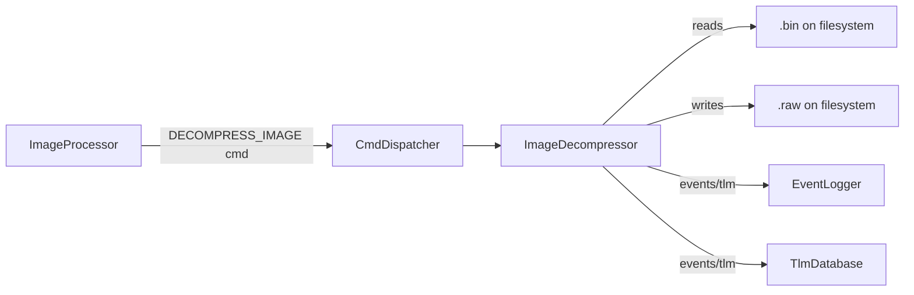
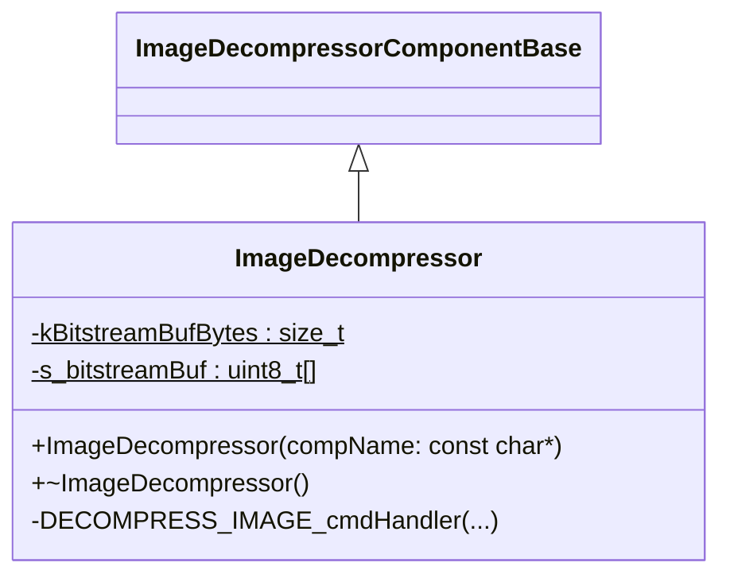
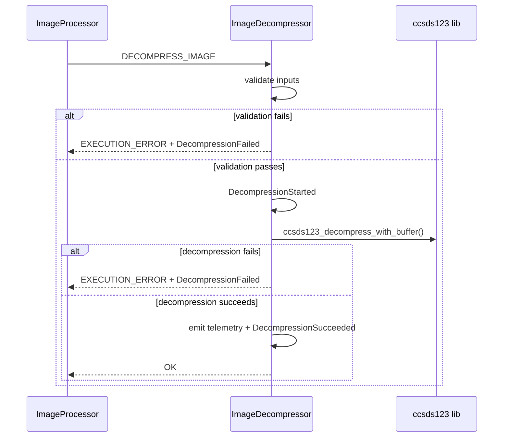

# ImageProcessor::ImageDecompressor

Decompresses image bitstream (.bin) into .raw using CCSDS123 algo.

## Usage Examples
Example command usage:

- Decompress a CCSDS123 .bin stream into a .raw file in a target directory.

Command:

DECOMPRESS_IMAGE /data/cam/compressed/scene.bin /data/cam/decompressed 2097152

### Diagrams

### Typical Usage
The component receives DECOMPRESS_IMAGE, validates inputs, decompresses the bitstream using CCSDS123, emits events, and publishes telemetry for runtime and sizes.

## Class Diagram

## Port Descriptions
| Name | Description |
|---|---|
| timeCaller | Time get port used for decompression timing telemetry. |
| prmGetOut | Parameter get port. |
| prmSetOut | Parameter set port. |
| cmdIn/cmdOut | Standard command receive/response ports from Fw.Command. |
| eventOut | Standard event output port from Fw.Event. |
| tlmOut | Standard telemetry output port from Fw.Channel. |

## Component States
| Name | Description |
|---|---|
| Idle | No decompression in progress. |
| Decompressing | Active while DECOMPRESS_IMAGE is executing. |

## Sequence Diagrams

## Parameters
| Name | Description |
|---|---|
| None | No parameters are defined. |

## Commands
| Name | Description |
|---|---|
| DECOMPRESS_IMAGE | Decompresses a .bin bitstream into a .raw file using CCSDS123. Inputs include input file path, output directory, and image_sample_len. |

## Events
| Name | Description |
|---|---|
| DecompressionStarted | Emitted when decompression begins. |
| DecompressionFailed | Emitted when validation or decompression fails. Includes error code. |
| DecompressionSucceeded | Emitted when decompression succeeds. Includes output size and ratio. |

## Telemetry
| Name | Description |
|---|---|
| DecompressionTimeMs | Total decompression runtime in milliseconds. |
| InputBitstreamSize | Input bitstream size in bytes. |
| OutputImageSize | Output image size in bytes. |
| ExpansionRatio | OutputImageSize / InputBitstreamSize. |

## Unit Tests
| Name | Description | Output | Coverage |
|---|---|---|---|
| Validation::EmptyInputPath | Sends DECOMPRESS_IMAGE with an empty input file path and verifies the command returns EXECUTION_ERROR with a DecompressionFailed event (error code -1). | EXECUTION_ERROR, DecompressionFailed | IMG-DECOMP-002 |
| Validation::EmptyOutputDir | Sends DECOMPRESS_IMAGE with an empty output directory and verifies the command returns EXECUTION_ERROR with a DecompressionFailed event (error code -1). | EXECUTION_ERROR, DecompressionFailed | IMG-DECOMP-002 |
| Validation::ImageSampleLenTooLarge | Sends DECOMPRESS_IMAGE with image_sample_len exceeding the internal buffer capacity and verifies the command returns EXECUTION_ERROR with a DecompressionFailed event (error code -1). | EXECUTION_ERROR, DecompressionFailed | IMG-DECOMP-002 |

## Requirements
| Name | Description | Validation |
|---|---|---|
| IMG-DECOMP-001 | The component shall decompress a CCSDS123 bitstream file into a raw image file given a valid input path and output directory. | Analysis/Test |
| IMG-DECOMP-002 | The component shall reject commands with missing paths or invalid image_sample_len. | Analysis/Test |
| IMG-DECOMP-003 | The component shall emit telemetry for decompression time and input/output sizes. | Analysis/Test |
| IMG-DECOMP-004 | The component shall emit a success or failure event for each command invocation. | Analysis/Test |